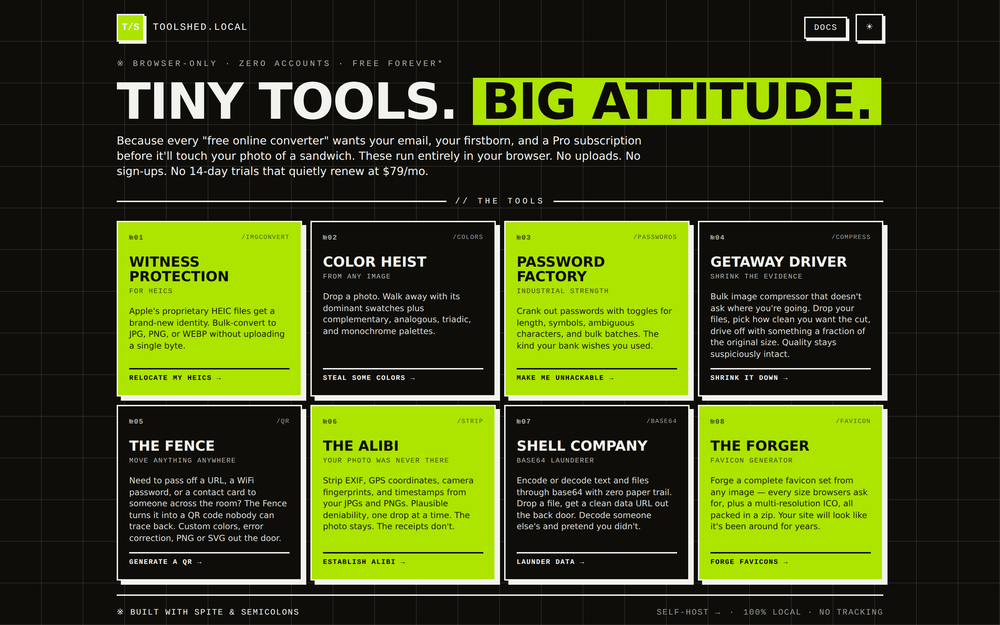
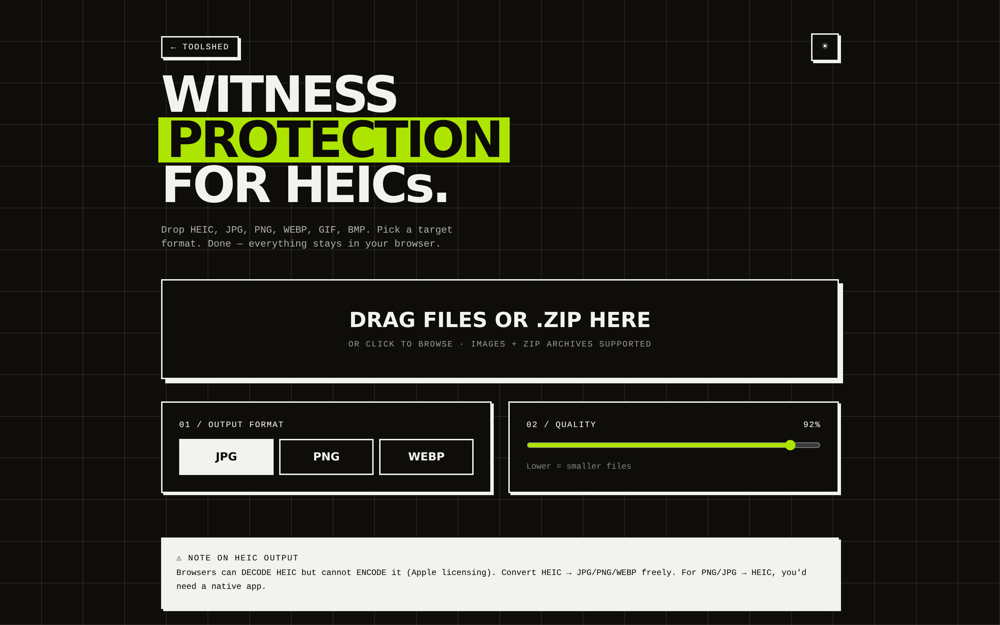
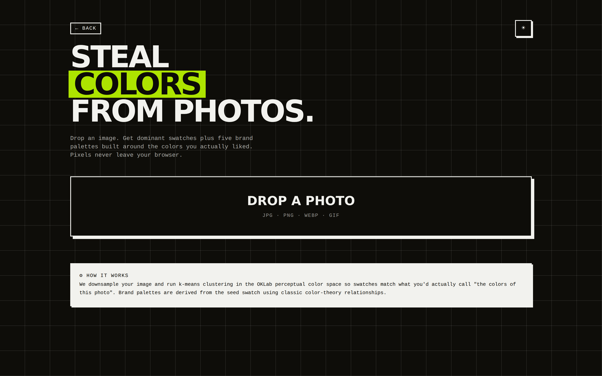
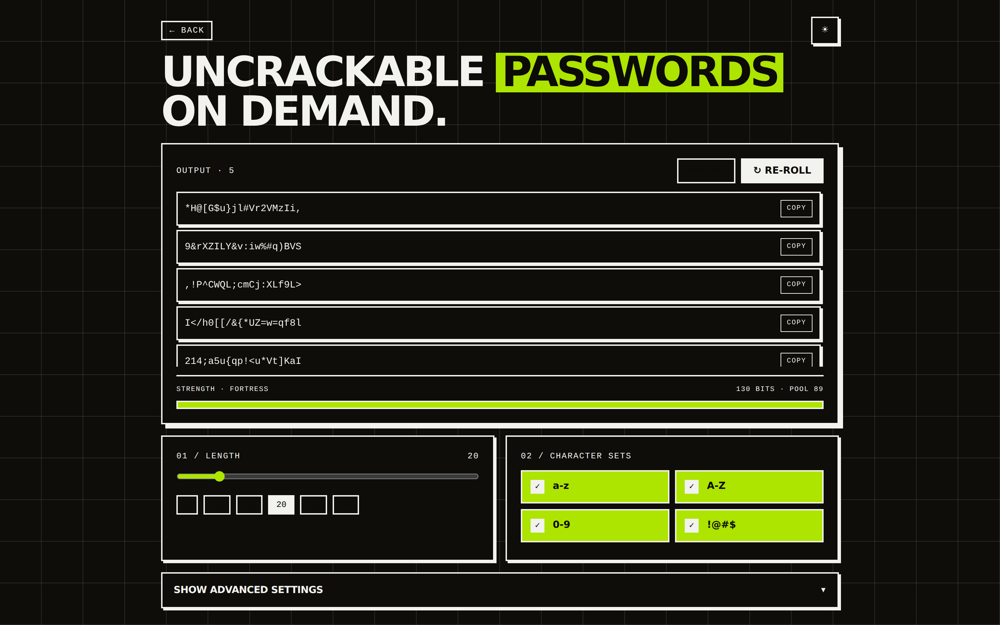
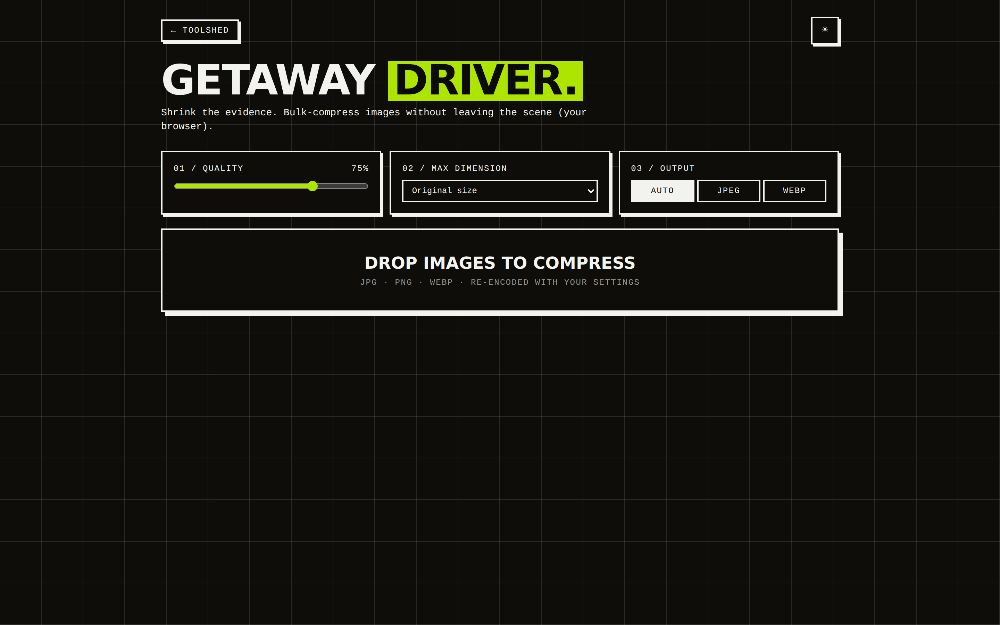
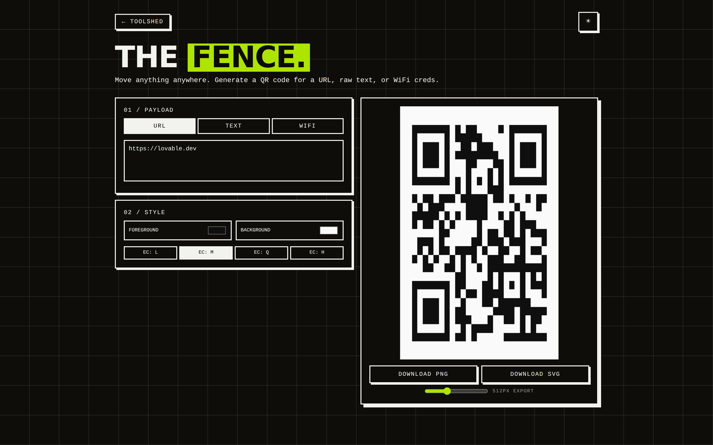
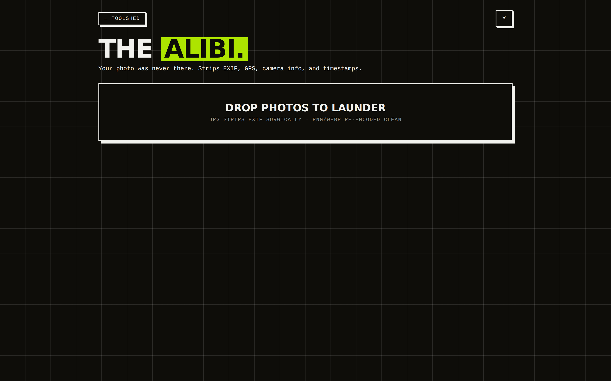
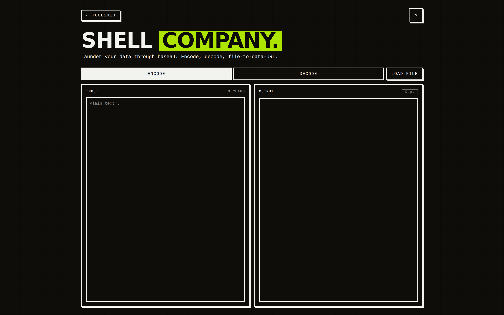
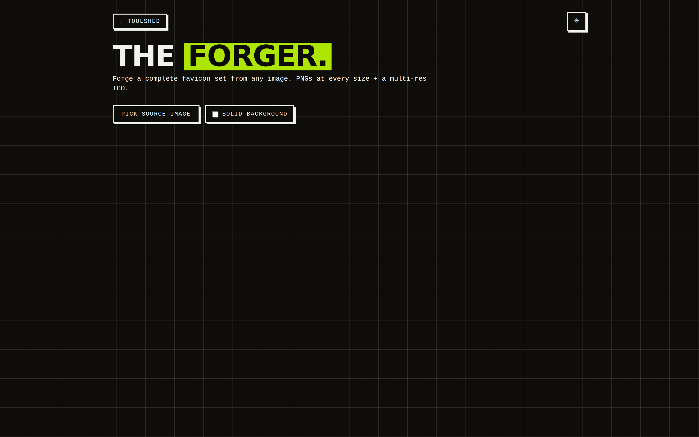
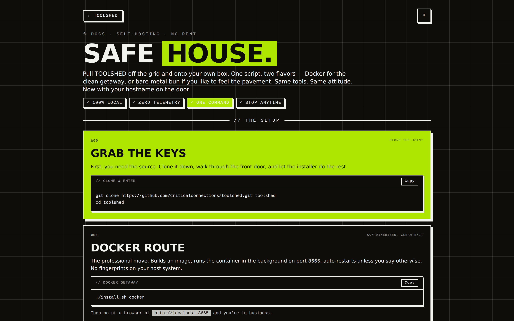

# TOOLSHED

> Tiny tools. Big attitude.

A collection of dumb-simple browser tools that don't waste your time. Convert HEICs,
extract palettes, generate passwords, scrub EXIF, encode base64, forge favicons.
Everything runs **in your browser** — no uploads, no accounts, no 14-day trials that
quietly renew at $79/mo.



---

## The tools

### 01 / Witness Protection — HEIC convert

Apple's proprietary HEIC files get a brand-new identity. Bulk-convert to JPG, PNG,
or WEBP without uploading a single byte. Falls back through `heic-to` (libheif 1.21)
to `heic2any` (libheif 1.10) so the long tail of weird HEICs still decodes.



### 02 / Color Heist — palette extractor

Drop a photo. Walk away with its dominant swatches plus complementary, analogous,
triadic, and monochrome palettes. K-means clustering in OKLab so the swatches match
what you'd actually call "the colors of this photo."



### 03 / Password Factory — generator

Crank out passwords with toggles for length, symbols, ambiguous characters, and
bulk batches. The kind of passwords your bank wishes you used. Strength meter
included.



### 04 / Getaway Driver — image compressor

Bulk image compressor that doesn't ask where you're going. Drop your files, pick
how clean you want the cut, drive off with something a fraction of the original
size. Quality stays suspiciously intact.



### 05 / The Fence — QR code generator

Move anything anywhere. URL, raw text, or WiFi credentials → a QR code nobody can
trace back. Custom colors, error correction, PNG or SVG out the door.



### 06 / The Alibi — EXIF stripper

Strip EXIF, GPS coordinates, camera fingerprints, and timestamps from your JPGs
and PNGs. Plausible deniability, one drop at a time. The photo stays. The receipts
don't.



### 07 / Shell Company — base64 encoder/decoder

Encode or decode text and files through base64 with zero paper trail. Drop a file,
get a clean data URL out the back door. Decode someone else's and pretend you
didn't.



### 08 / The Forger — favicon generator

Forge a complete favicon set from any image — every size browsers ask for, plus a
multi-resolution ICO, all packed in a zip. Your site will look like it's been
around for years.



---

## Self-hosting

> Pull TOOLSHED off the grid and onto your own box. One script, two flavors —
> Docker for the clean getaway, or bare-metal bun if you like to feel the pavement.



```bash
git clone https://github.com/criticalconnections/toolshed.git
cd toolshed
./install.sh docker         # containerized, port 8665
# or
./install.sh self-hosted    # bare-metal bun
./install.sh stop           # tear down the docker container
```

Same tools. Same attitude. 100% local, zero telemetry.

---

## Development

[Bun](https://bun.sh) is the package manager. Vite handles the dev server (with
the Cloudflare Workers runtime emulated via `@cloudflare/vite-plugin`).

```bash
bun install
bun run dev        # vite dev server
bun run build      # production build (Cloudflare Workers bundle)
bun run preview    # preview the built bundle
bun run lint       # eslint
bun run format     # prettier
```

### Stack

- **TanStack Start** with file-based routing in `src/routes/`
- **React 19**, **Vite 7**, **Tailwind v4**
- **shadcn/ui** (`new-york` style) under `src/components/ui/`
- **Cloudflare Workers** as the production target (the "server" is a Worker that
  ships the SSR shell — all logic runs in the browser)

### Adding a tool

Tools are top-level routes (`src/routes/<tool>.tsx`). Register the new route both
as a route file and in the `TOOLS` array in `src/routes/index.tsx` so it shows up
on the landing page.

See [`CLAUDE.md`](CLAUDE.md) for the full architectural rundown.

---

## License

MIT. Built with spite & semicolons.
